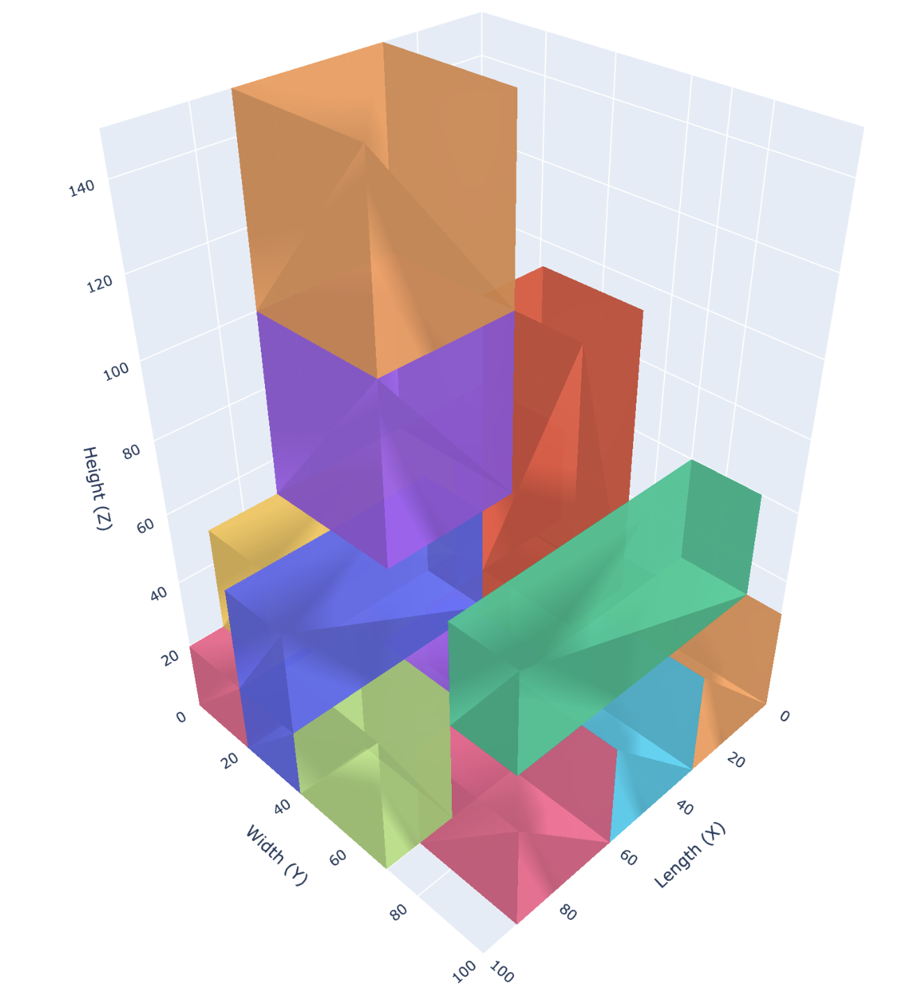
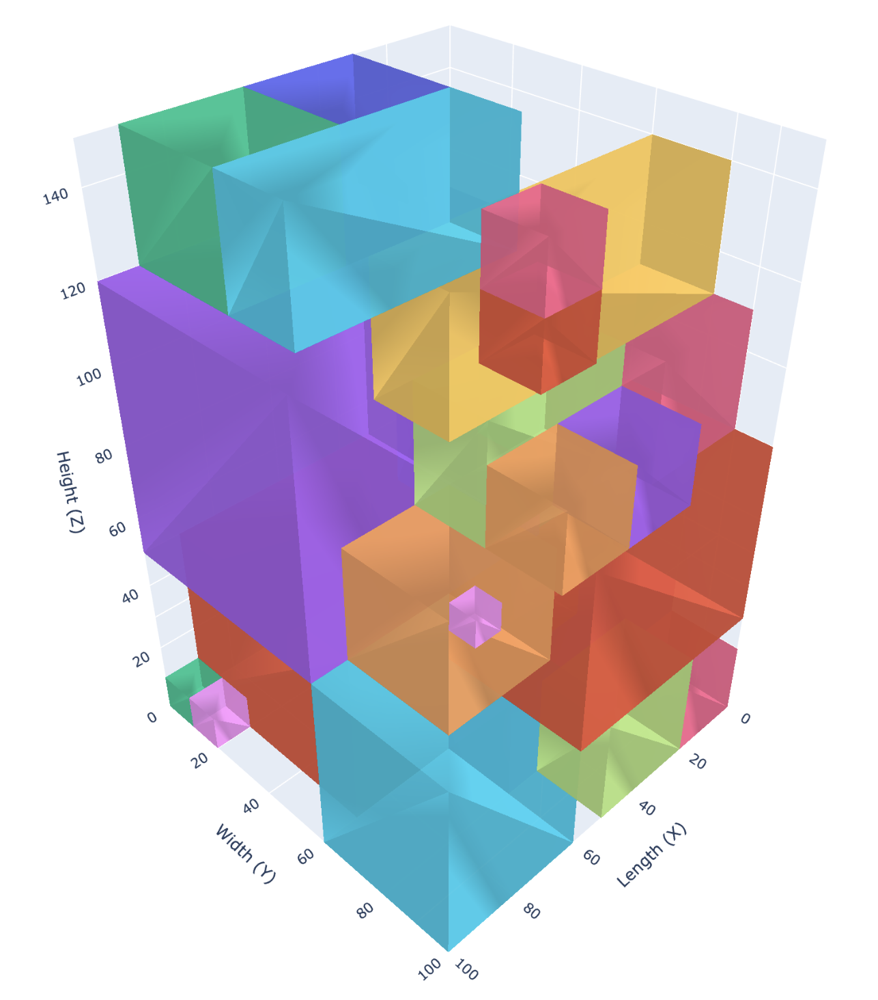

# 籠車
## Online 3D bin packing

本專案的軟體部分可歸類為**Online Bin Packing (Online BPP)** 問題，即需依當下所見的物品大小進行裝箱任務。在本專案中，需要設計一演算法使用機器手臂將一系列長方體物品逐個裝入固定大小的物流籠車中，目標是盡量減少空間浪費並確保穩定性，期望達到比人工裝箱更快，裝載率更高。在在線場景中，物品按順序從輸送帶到達，必須在不知道未來物品的情況下即時完成決策。目前實現了一個基於**啟發式規則 (Heuristics)** 的版本，模擬了從感知貨物、決策放置到更新狀態的完整流程。演算法的核心是 **Bottom-Left 策略**，並結合了多種物理約束條件，以確保裝箱方案的現實可行性。


## 檔案結構
```
3DBPP
├── main.py                 # (主程式)
├── config.py               # (設定檔)
└── bpp_solver/             # (核心演算法模組)
    ├── data_structures.py  # (定義資料結構)
    ├── geometry.py         # (幾何計算工具)
    ├── constraints.py      # (重量、支撐面積與重心限制)
    ├── surface_manager.py  # (支撐平面管理器)
    ├── scoring.py          # (為放置方案評分)
        z最小-> y最小 -> x最小
    ├── box_gen.py          # (生成測試用資料csv)
    └── packer.py           # (裝箱決策者)
 ```   

## 核心功能
目前使用Bottom-Left，掃描上方平面，根據評分函數選擇最佳放置位置，並切割平面生成新平面
*   **Bottom-Left** 策略，以z最小-> y最小 -> x最小 順序遍歷所有左下角點放置。
*   **hard- constraints**:
    *   **尺寸與重量**: 確保貨物不超出籠車邊界(不允許超高堆疊)且不超重。
    *   **接觸面積穩定度**: 貨物底部與支撐面的接觸面積必須達到設定的最小比例 (`STABILITY_FACTOR` = 0.75)。

    *   (**物品自身穩定度**: 貨物的重心投影必須落在其下方的支撐平面內，防止自身翻倒。)
    *   **籠車整體穩定度**: 放置後，整個籠車的總重心必須保持在底部的安全區域內。
*   **動態支撐平面管理**:


*   每次放置後，系統會自動**切割**被佔用的舊平面，並在貨物頂部**創建**新平面，最後將相鄰且同高的平面合併，合併平面容許誤差merge-margin。
*   **可配置性**: 所有關鍵參數（如籠車尺寸、誤差、穩定度因子）都集中在 `config.py` 中，方便調整與優化。
*   **資料驅動**: 支援從 `.csv` 檔案讀取貨物清單，方便進行測試和驗證。
 
## Install 
```
To make this project work, there are two things you should do:
* Install Python packages in 'requirements.py' (by 'pip install -r requirements.txt').
* (This code works on Python 3.11)
```
## Run
we provide a unified interface in 'main.py', please run with the example dataset 'conveyor_items.csv'
```
python main.py
python main.py --merge # 打開合併平面功能

# main.py 的執行流程
# 讀入csv檔作為輸送帶清單物品-> 
# 每次遍歷前四個貨物，呼叫 packer.py 選擇最佳放置方案->
# 繪製可視化3D圖
```
## Result Demo
**資料集**
```
id,base_dimensions,weight,allowed_rotations,is_fragile
1,"(57, 67, 67)",34.3,"[0,1,2,3,4,5]",False
2,"(57, 57, 47)",30.9,"[0,1,2,3,4,5]",False
3,"(57, 37, 47)",24.5,"[0,1,2,3,4,5]",False
4,"(57, 37, 47)",24.5,"[0,1,2,3,4,5]",False
5,"(77, 37, 37)",21.1,"[0,1,2,3,4,5]",False
6,"(37, 37, 47)",16.4,"[0,1,2,3,4,5]",False
7,"(37, 37, 47)",16.4,"[0,1,2,3,4,5]",False
8,"(77, 17, 27)",11.5,"[0,1,2,3,4,5]",False
9,"(77, 17, 27)",11.5,"[0,1,2,3,4,5]",False
10,"(57, 17, 27)",9.2,"[0,1,2,3,4,5]",False
11,"(57, 17, 27)",9.2,"[0,1,2,3,4,5]",False
12,"(37, 17, 27)",6.9,"[0,1,2,3,4,5]",False
13,"(27, 27, 27)",5.4,"[0,1,2,3,4,5]",False
14,"(27, 27, 27)",5.4,"[0,1,2,3,4,5]",False
15,"(27, 27, 27)",5.4,"[0,1,2,3,4,5]",False
16,"(27, 27, 27)",5.4,"[0,1,2,3,4,5]",False
17,"(27, 27, 27)",5.4,"[0,1,2,3,4,5]",False
18,"(27, 27, 17)",4.1,"[0,1,2,3,4,5]",False
19,"(17, 17, 17)",2.2,"[0,1,2,3,4,5]",False
20,"(17, 17, 17)",2.2,"[0,1,2,3,4,5]",False
21,"(17, 17, 17)",2.2,"[0,1,2,3,4,5]",False
22,"(17, 17, 17)",2.2,"[0,1,2,3,4,5]",False
23,"(17, 17, 17)",2.2,"[0,1,2,3,4,5]",False
24,"(17, 17, 17)",2.2,"[0,1,2,3,4,5]",False
25,"(17, 17, 17)",2.2,"[0,1,2,3,4,5]",False
26,"(17, 17, 17)",2.2,"[0,1,2,3,4,5]",False
27,"(17, 17, 17)",2.2,"[0,1,2,3,4,5]",False
28,"(7, 7, 7)",2.2,"[0,1,2,3,4,5]",False
29,"(7, 7, 7)",2.2,"[0,1,2,3,4,5]",False
30,"(7, 7, 7)",2.2,"[0,1,2,3,4,5]",False
```
### case1 隨機亂數生成:
```
# params
NUM_ITEMS = 10  # 生成的物品數量
ITEM_DIMENSIONS_RANGE = {
    'length': (10, 100),  # 單位: cm
    'width': (1, 100),   # 單位: cm
    'height': (10, 100),   # 單位: cm
    'weight': (1, 30)  # 單位: kg
}

id,base_dimensions,weight,allowed_rotations,is_fragile
1,"(60, 70, 50)",40,"[0,1,2,3,4,5]",False
2,"(45, 30, 60)",40,"[0,1,2,3,4,5]",False
3,"(35, 35, 60)",50,"[0,1,2,3,4,5]",False
4,"(50, 60, 80)",30,"[0,1,2,3,4,5]",False
5,"(10, 80, 20)",20,"[0,1,2,3,4,5]",False
6,"(20, 20, 20)",30,"[0,1,2,3,4,5]",False
7,"(20, 20, 80)",40,"[0,1,2,3,4,5]",False
8,"(80, 10, 10)",10,"[0,1,2,3,4,5]",False
9,"(40, 40, 40)",20,"[0,1,2,3,4,5]",False
10,"(50, 50, 50)",30,"[0,1,2,3,4,5]",False
```


### 籠車空間利用率: 40.60%, 放置物品 8/10 
物品id = 4: 因為**支撐面積不足以確保穩定性**、**超出籠車邊界**
物品id = 10: 因為**超過籠車重量限制**、**超出籠車邊界**、**放置物品後籠車重心不穩定**等原因無法被機器手臂放入

### case2 自訂資料，物品的尺寸被設計成可以相互整除或匹配:
```
id,base_dimensions,weight,allowed_rotations,is_fragile
1,"(57, 67, 67)",34.3,"[0,1,2,3,4,5]",False
2,"(57, 57, 47)",30.9,"[0,1,2,3,4,5]",False
3,"(57, 37, 47)",24.5,"[0,1,2,3,4,5]",False
4,"(57, 37, 47)",24.5,"[0,1,2,3,4,5]",False
5,"(77, 37, 37)",21.1,"[0,1,2,3,4,5]",False
6,"(37, 37, 47)",16.4,"[0,1,2,3,4,5]",False
7,"(37, 37, 47)",16.4,"[0,1,2,3,4,5]",False
8,"(77, 17, 27)",11.5,"[0,1,2,3,4,5]",False
9,"(77, 17, 27)",11.5,"[0,1,2,3,4,5]",False
10,"(57, 17, 27)",9.2,"[0,1,2,3,4,5]",False
11,"(57, 17, 27)",9.2,"[0,1,2,3,4,5]",False
12,"(37, 17, 27)",6.9,"[0,1,2,3,4,5]",False
13,"(27, 27, 27)",5.4,"[0,1,2,3,4,5]",False
14,"(27, 27, 27)",5.4,"[0,1,2,3,4,5]",False
15,"(27, 27, 27)",5.4,"[0,1,2,3,4,5]",False
16,"(27, 27, 27)",5.4,"[0,1,2,3,4,5]",False
17,"(27, 27, 27)",5.4,"[0,1,2,3,4,5]",False
18,"(27, 27, 17)",4.1,"[0,1,2,3,4,5]",False
19,"(17, 17, 17)",2.2,"[0,1,2,3,4,5]",False
20,"(17, 17, 17)",2.2,"[0,1,2,3,4,5]",False
21,"(17, 17, 17)",2.2,"[0,1,2,3,4,5]",False
22,"(17, 17, 17)",2.2,"[0,1,2,3,4,5]",False
23,"(17, 17, 17)",2.2,"[0,1,2,3,4,5]",False
24,"(17, 17, 17)",2.2,"[0,1,2,3,4,5]",False
25,"(17, 17, 17)",2.2,"[0,1,2,3,4,5]",False
26,"(17, 17, 17)",2.2,"[0,1,2,3,4,5]",False
27,"(17, 17, 17)",2.2,"[0,1,2,3,4,5]",False
28,"(7, 7, 7)",2.2,"[0,1,2,3,4,5]",False
29,"(7, 7, 7)",2.2,"[0,1,2,3,4,5]",False
30,"(7, 7, 7)",2.2,"[0,1,2,3,4,5]",False
```
### 1. 貨物來時按體積降冪排序(最佳情況):

### 籠車空間利用率: 93.00%, 放置物品 29/30 

### 2. 貨物來時按體積升冪排序(最差情況):

### 籠車空間利用率: 38.67%, 放置物品 25/30 

### 3. 貨物來時亂序(實際情況):

### 籠車空間利用率: 72.93%,  放置物品 27/30 


## 最佳化籠車裝載演算法 (Optimized Cage Trolley Packing Algorithm)

**演算法總覽 (Algorithm Overview)**
本演算法旨在為機器手臂提供即時、高效的籠車裝載策略。核心目標是在滿足所有物理與操作約束的前提下，優先保證裝載速度（秒級決策），其次才是最大化空間利用率。

演算法採用啟發式策略 (Heuristic Strategy)，結合支撐平面管理 (Support Surface Management) 與 有限預覽 (Limited Lookahead) 的方式，在動態變化的環境中為每一個新進貨物快速找到一個「足夠好」而非「絕對最佳」的放置位置。
```
Algorithm: cage trolley
Online-bin packing – 事前不知道貨物輸入清單
# --- Phase 0: System Initialization & Setup ---

# 輸入：預計要存入的所有箱子列表 (col: ID、item_dims(長,寬,高)、重量、可旋轉的方向(最多為6)、是否易碎)
# 輸出：若籠車裝不下輸出籠車已滿
==========================================
# --- Phase 1: 
使用左下角法進行籠車裝載
# ==========================================================

若無法再塞入新物件，Terminate()等待人工換籠車後重啟演算法
while (!TEMP AND !conveyor_items):
步驟 1: 建立候選物品列表，根據重量、體積大小按照優先度排序
步驟 2: 遍歷所有候選物品的放置方向，對所有可行的放置方案依照分數找到最佳的放置方案
	
# Constraint Checking Function
在步驟 2 中，每次嘗試放置時，都必須通過以下所有檢查：
1. 不能超出籠車的邊界
2. 不能超重
3. 支撐面積是否足夠
4. 籠車是否會傾倒

# Placement Score Function(依照分數篩選所有可行解):
此函式對所有可放置平面打分數:
1. 平面的高度越低，分數越高
2. 如何解決貨物傾斜:
	優先選擇物品底面積最大的方位進行放置
	若該平面周圍有物體可倚靠，給予該平面較高分
w1, w2是可調整的權重，詳情見敏感度分析
# ==========================================================
# --- Phase 2: 支撐平面管理Support Surface Management---
# ==========================================================
這是一個輔助模組，在每次成功放置後切割與合併剩餘平面。
update_support_surfaces(placed_item, position, rotation):
1.	切割舊平面: 找到被 placed_item 覆蓋的那個 SupportSurface。根據 placed_item 的底部面積，將此平面切割成最多四個新的、更小的矩形平面，同時刪除被完全覆蓋的原平面。
2.	創建新平面: 在 placed_item 的頂部創建一個新的 SupportSurface。其 z 值為 position.z + placed_item.height。
3.	合併相鄰平面: 遍歷所有平面，如果發現多個平面高度相近且在 xy 平面上相鄰，則將它們合併成一個更大的矩形平面。。
```